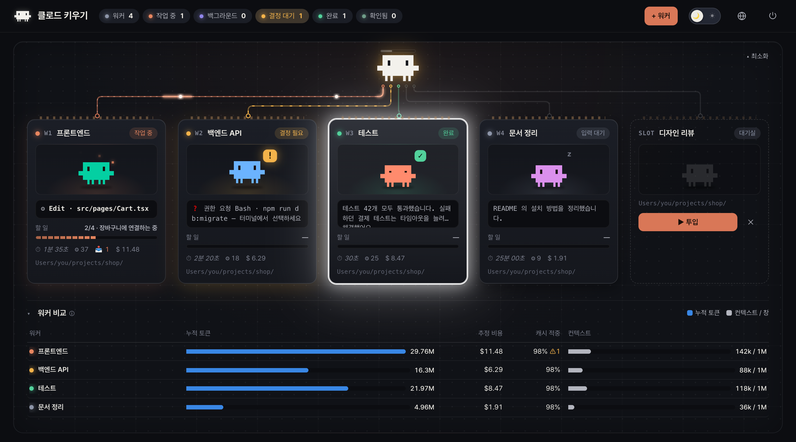
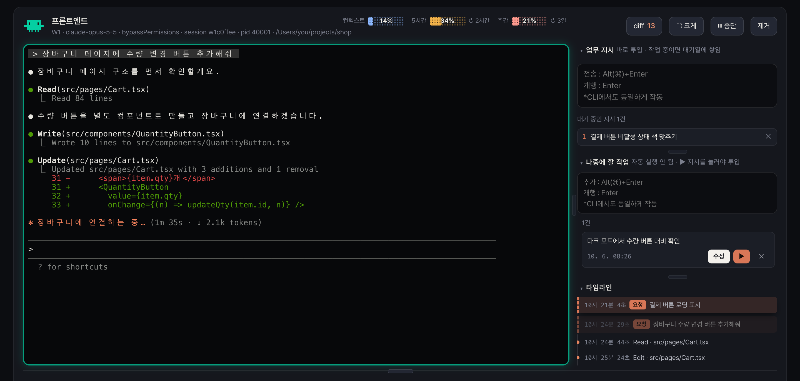
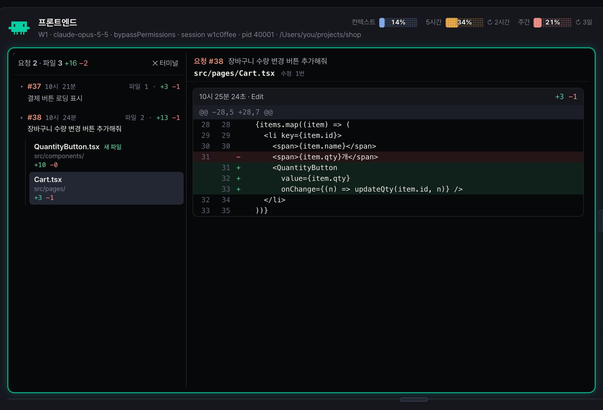
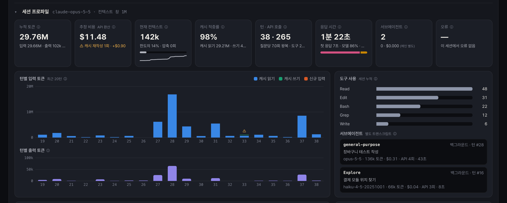
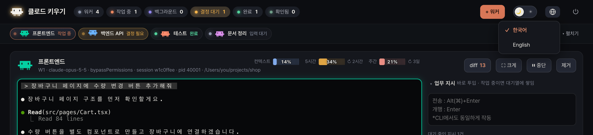
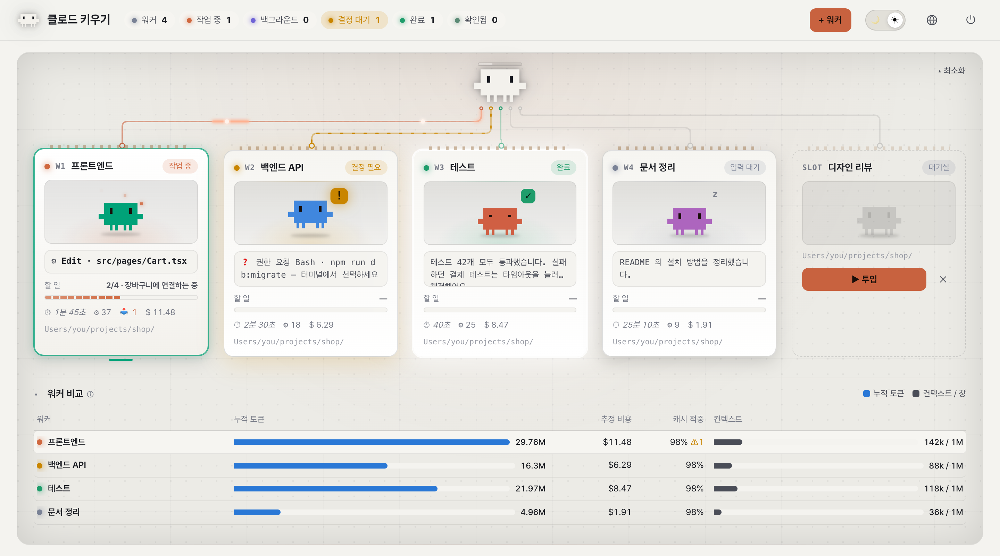

# 클로드 키우기 (agent-manager)

[English](README.md) | **한국어**

내 PC의 **여러 Claude Code 세션(워커)을 브라우저 한 화면에서 관리**하는 대시보드입니다.
일을 나눠 주고, 진행을 지켜보고, 고친 내용과 비용을 확인합니다.



- 워커는 평소 쓰는 `claude` CLI 그대로라 슬래시 명령·스킬·MCP·설정이 같습니다.
- `127.0.0.1`에서만 열리는 **내 PC 전용** 도구입니다 (외부 통신·원격 접속 없음).
- 대시보드를 재시작해도 **워커는 끊기지 않고** 다시 붙습니다.

## 설치

준비물: **Node.js 20 이상**, 로그인된 **Claude Code CLI**, Windows 10/11 또는 macOS

```bash
git clone https://github.com/stzjinseong/agent-manager.git
```

클론한 폴더에서 `claude`를 열고 아래 명령을 입력하면 확인부터 설치까지 대신 해 줍니다.

#### macOS

1. 설치: `/setup --mac`
2. 실행: `Launch.app`을 열거나, 터미널에서 `agent-manager` 입력!

> `Launch.app`을 처음 열 때 보안 경고가 뜨면 Finder에서 **우클릭 → 열기**.

#### Windows

1. 설치: `/setup --windows`
2. 실행: `Launch.vbs`를 열거나, PowerShell에서 `agent-manager` 입력!

## 사용법

### 1. 워커 띄우기

오른쪽 위 **+ 워커**를 누르고 역할 이름과 작업 폴더를 정한 뒤 **띄우기**.
**역할 저장**을 켜 두면 워커를 닫아도 카드가 **대기실**에 남아 **▶ 투입**으로 다시 띄울 수 있습니다.


카드에서 워커의 상태(작업 중 · 결정 필요 · 완료 · 입력 대기), 지금 하는 일, 할 일 진행률, 비용을 한눈에 봅니다.
카드를 끌어 순서를 바꾸고, 이름을 더블클릭해 바꿀 수 있습니다.

### 2. 일 시키고 지켜보기

카드를 누르면 아래에 그 워커의 터미널이 열립니다. 다시 누르면 닫힙니다.



- **업무 지시** — 바로 투입됩니다. 작업 중이면 대기열에 쌓였다가 차례대로 들어갑니다.
- **나중에 할 작업** — 떠오른 일을 적어 두는 메모. **▶ 버튼**을 눌러야 투입됩니다.
- **타임라인** — 요청·도구 사용·완료 기록. 요청을 누르면 터미널의 그 위치로 이동합니다.
- 터미널에 직접 입력해도 됩니다. **⛶ 크게**로 넓게 보고, **⏸ 중단**은 Esc를 보냅니다.

권한 승인이 필요하면 카드가 **결정 필요**로 바뀌고 브라우저 탭 아이콘에 점이 뜹니다.

### 3. 고친 내용 확인하기 (diff)

**diff**를 누르면 워커가 고친 파일의 변경 내용을 요청별로 볼 수 있습니다.
Claude가 직접 고친 파일은 물론 셸 명령·서브에이전트가 고친 파일도 나옵니다 (셸 명령은 git 저장소에서만).



### 4. 토큰·비용 살펴보기

워커를 열면 아래에 **세션 프로파일**이 나옵니다. 누적 토큰, 추정 비용, 컨텍스트, 캐시 적중률, 턴별 사용량을 보여 주고,
**ⓘ 아이콘**에 마우스를 올리면 각 지표의 의미와 활용법을 알려 줍니다.
위쪽 막대에서는 컨텍스트와 계정의 5시간·주간 사용 한도를 확인할 수 있습니다.



### 5. 화면 정리하기

- **▴ 최소화** — 카드를 헤더 아래 한 줄로 접습니다. 칩을 누르면 그 워커가 열립니다.
- **🌐** — 한국어 / English 전환.
- **🌙 / ☀** — 다크 / 라이트 모드.





## 알아 두기

### 입력 키

터미널(CLI)과 입력칸 모두 **Enter는 줄바꿈, Alt(⌥)/⌘ + Enter는 전송**으로 통일되어 있습니다.

| 어디서 | 줄바꿈 | 전송·확정 | 그 밖에 |
|---|---|---|---|
| 터미널(CLI) | Enter | Alt(⌥)/⌘ + Enter (권한 확인 등 선택지 확정도) | Ctrl+C: 선택한 글이 있으면 복사, 없으면 중단 · Ctrl+V: 붙여넣기 · 우클릭: 복사/붙여넣기 |
| 업무 지시 | Enter | Alt(⌥)/⌘ + Enter | 작업 중이면 대기열로 |
| 나중에 할 작업 | Enter | Alt(⌥)/⌘ + Enter (추가) | 수정 중: Alt(⌥)/⌘ + Enter 저장 · Esc 취소 |
| 워커 이름 변경 | — | Enter | Esc 취소 |

파일·이미지는 터미널이나 입력칸에 끌어다 놓거나 붙여 넣으면 첨부됩니다.

### 그 밖에

- **⏻** 버튼으로 서버만 끄거나(워커는 계속 실행) 워커까지 함께 끌 수 있습니다.
- 업데이트 후에는 화면에 뜨는 **↻ 지금 재시작**을 누르세요. 워커는 그대로 유지됩니다.
- 비용은 API 단가로 환산한 추정치입니다. 구독 사용 시 실제 청구액과 다릅니다.
- Chrome에 맞춰 만들어졌습니다.
