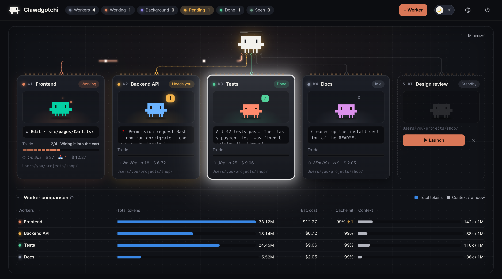
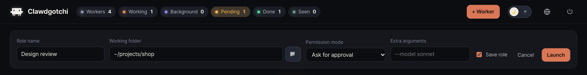
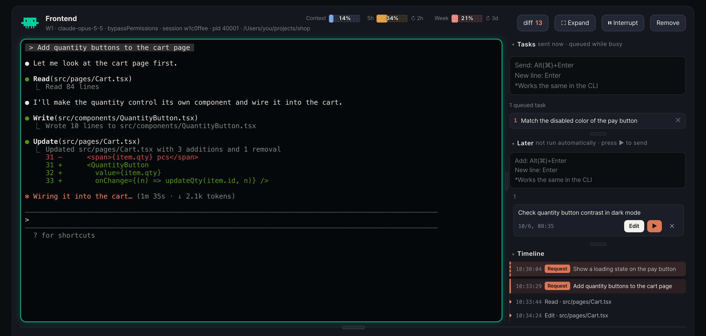
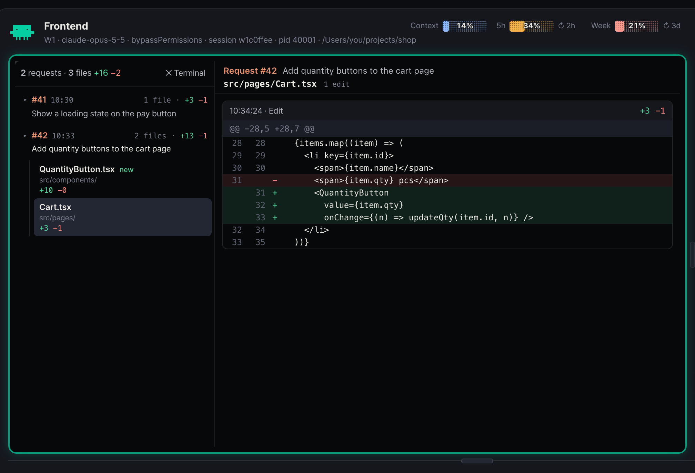
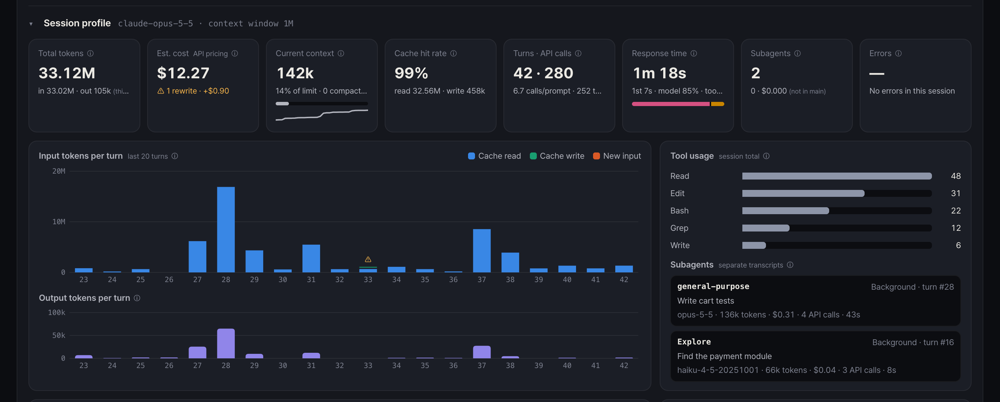
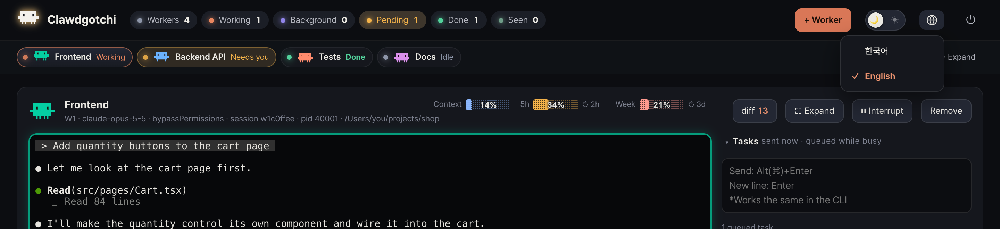
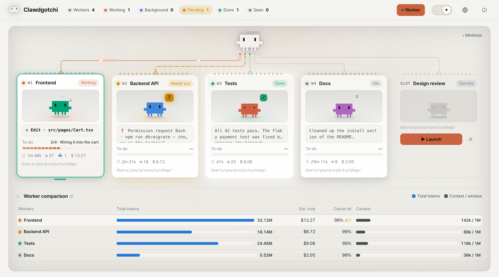

# Clawdgotchi (agent-manager)

**English** | [한국어](README.ko.md)

A dashboard for **managing multiple Claude Code sessions (workers) from a single browser page** on your own PC.
Hand out tasks, watch their progress, and review what they changed and what it cost.



- Each worker is the same `claude` CLI you already use, so your slash commands, skills, MCP servers and settings all work as usual.
- A **local-only** tool that listens on `127.0.0.1` only (no outside communication, no remote access).
- Restarting the dashboard **does not disconnect workers** — they reattach automatically.

## Installation

Requirements: **Node.js 20 or later**, a logged-in **Claude Code CLI**, Windows 10/11 or macOS

```bash
git clone https://github.com/stzjinseong/agent-manager.git
```

Open `claude` in the cloned folder and run the command below — it checks everything and installs for you.

#### macOS

1. Install: `/setup --mac`
2. Run: open `Launch.app`, or type `agent-manager` in a terminal!

> If a security warning appears the first time you open `Launch.app`, **right-click → Open** it in Finder.

#### Windows

1. Install: `/setup --windows`
2. Run: open `Launch.vbs`, or type `agent-manager` in PowerShell!

## How to use

### 1. Launch a worker

Click **+ Worker** at the top right, pick a role name and a working folder, then **Launch**.
With **Save role** on, the card stays in **Standby** after the worker closes, so you can bring it back with **▶ Launch**.



Each card shows the worker's status (Working · Needs you · Done · Idle), what it is doing now, to-do progress and cost at a glance.
Drag cards to reorder them, and double-click a name to rename it.

### 2. Give tasks and watch

Click a card to open that worker's terminal below. Click it again to close.



- **Tasks** — sent right away. While the worker is busy they queue up and go in one by one.
- **Later** — notes for things to do later. They are sent only when you press the **▶ button**.
- **Timeline** — requests, tool calls and completions. Click a request to jump to it in the terminal.
- You can also type in the terminal directly. **⛶ Expand** makes it bigger, and **⏸ Interrupt** sends Esc.

When a permission approval is needed, the card turns to **Needs you** and a dot appears on the browser tab icon.

### 3. Review changes (diff)

Click **diff** to see the file changes the worker made, grouped by request.
It covers files Claude edited directly as well as files changed by shell commands and subagents (shell commands only in git repositories).



### 4. Check tokens and cost

When a worker is open, the **Session profile** appears below it: total tokens, estimated cost, context, cache hit rate and per-turn usage.
Hover over an **ⓘ icon** to learn what each metric means and how to use it.
The bar at the top shows the context and your account's 5-hour and weekly usage limits.



### 5. Tidy up the screen

- **▴ Minimize** — collapse the cards into one row under the header. Click a chip to open that worker.
- **🌐** — switch between 한국어 / English.
- **🌙 / ☀** — dark / light mode.





## Good to know

### Input keys

In the terminal (CLI) and in every input box, **Enter adds a new line and Alt(⌥)/⌘ + Enter sends**.

| Where | New line | Send / confirm | Other |
|---|---|---|---|
| Terminal (CLI) | Enter | Alt(⌥)/⌘ + Enter (also confirms choices such as permission prompts) | Ctrl+C: copy if text is selected, otherwise interrupt · Ctrl+V: paste · Right-click: copy/paste |
| Tasks | Enter | Alt(⌥)/⌘ + Enter | Queued if the worker is busy |
| Later | Enter | Alt(⌥)/⌘ + Enter (add) | While editing: Alt(⌥)/⌘ + Enter to save · Esc to cancel |
| Rename a worker | — | Enter | Esc to cancel |

Drag files or images onto the terminal or an input box, or paste them, to attach them.

### Other

- Use the **⏻** button to shut down just the server (workers keep running) or the workers too.
- After updating, click **↻ Restart now** when it appears. Workers keep running.
- Costs are estimates at API prices and differ from your actual bill on a subscription.
- Built for Chrome.
